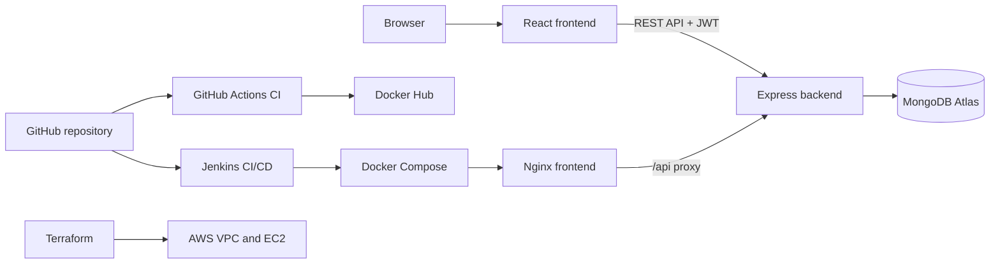

# CareerMatrix

CareerMatrix is a containerized full-stack job application tracker. It allows authenticated users to manage job applications and target companies, monitor application progress, and view job-search activity from a dashboard.

## Features

- User registration, login, JWT authentication, and profile updates
- Job application CRUD with application status tracking
- Application search, status filters, due dates, notes, and CSV export
- Company management with company details, notes, and application counts
- Dashboard metrics, weekly activity chart, recent applications, and activity calendar
- Responsive React user interface

## Technology stack

| Layer | Technologies |
| --- | --- |
| Frontend | React, Vite, React Router, Zustand, Tailwind CSS, Chart.js |
| Backend | Node.js, Express, Mongoose, JWT, bcryptjs |
| Database | MongoDB Atlas or MongoDB |
| Containers | Docker, Docker Compose, Nginx |
| CI | GitHub Actions, Docker Hub |
| Deployment | Jenkins, Docker Compose |
| Infrastructure | Terraform, AWS |

## Architecture



## Repository layout

```text
.
├── backend/                  # Express API, routes, models, and controllers
├── frontend/                 # React/Vite user interface
├── .github/workflows/ci.yml  # GitHub Actions Docker image pipeline
├── Jenkinsfile               # Jenkins build and deployment pipeline
├── docker-compose.yml        # Frontend and backend container definition
└── terraform/                # AWS infrastructure configuration
```

## Application modules

| Module | Description |
| --- | --- |
| Authentication | Register, login, JWT-protected requests, current-user lookup, and profile updates |
| Applications | Create, read, update, delete, filter, export, and track job applications |
| Companies | Save target companies with website, industry, location, research notes, and application counts |
| Dashboard | Shows application totals, weekly activity, recent applications, and an activity calendar |

## Prerequisites

- Node.js 20 or later
- npm
- MongoDB Atlas account or a local MongoDB instance
- Docker Desktop for containerized deployment
- Terraform and AWS credentials for infrastructure provisioning

## Local setup

### Backend

Create `backend/.env`:

```env
MONGO_URI=mongodb+srv://<database-user>:<database-password>@<cluster-host>/careermatrix?retryWrites=true&w=majority
JWT_SECRET=<long-random-secret>
PORT=5000
```

Install dependencies and start the API:

```powershell
cd backend
npm install
npm run dev
```

The backend health endpoint is available at `http://localhost:5000/health`.

### Frontend

Create `frontend/.env`:

```env
VITE_API_URL=http://localhost:5000/api
```

Install dependencies and start the frontend:

```powershell
cd frontend
npm install
npm run dev
```

Open `http://localhost:5173`.

> The MongoDB account used in `MONGO_URI` must be an Atlas **Database Access** user. If its password includes reserved URL characters, encode the password before placing it in the URI.

## Demo data

The project includes an idempotent seed script that creates a demo user, 10 companies, and applications across the previous 30 days:

```powershell
cd backend
node scripts/seedDemo.js
```

Run it only after configuring a working MongoDB connection.

## Docker

The frontend image is built with Vite and served by Nginx. Nginx serves the React application and proxies browser requests from `/api` to the backend container. The backend image runs the Express API and connects to MongoDB Atlas.

Build and start both containers:

```powershell
docker compose up --build -d
```

| Service | Host port | Container port |
| --- | ---: | ---: |
| Frontend | 3000 | 80 |
| Backend | 5000 | 5000 |

Docker Compose reads backend variables from `backend/.env`. The backend is only reachable inside the Compose network; users access the application through `http://<server-ip>:3000`, and Nginx forwards `/api` calls internally.

For local Vite development, `frontend/.env` can set `VITE_API_URL=http://localhost:5000/api`. When that variable is not present, the application uses `/api`, which is the correct containerized deployment path.

## CI with GitHub Actions

Workflow file: `.github/workflows/ci.yml`

This is the cloud CI approach. The workflow runs for pull requests targeting `main`, pushes to `main`, and manual workflow dispatches.

1. Installs backend dependencies and checks backend syntax.
2. Installs frontend dependencies and creates a production build.
3. Builds both Docker images to verify the container definitions.
4. On a successful push to `main`, authenticates to Docker Hub.
5. Publishes both images with `latest` and immutable Git commit-SHA tags.

Required GitHub secrets:

| Secret | Purpose |
| --- | --- |
| `DOCKER_USERNAME` | Docker Hub username |
| `DOCKER_PASSWORD` | Docker Hub password or access token |

## Deployment with Jenkins

Pipeline file: `Jenkinsfile`

This is a separate self-hosted CI/CD approach. It does not depend on the Docker Hub images produced by GitHub Actions. The Jenkins agent checks out the source, builds local Docker images, and deploys those verified local images with Docker Compose.

The Jenkins pipeline contains the following stages:

1. **Checkout** — checks out the configured source repository.
2. **Build Backend** — builds the backend Docker image.
3. **Build Frontend** — builds the frontend Docker image.
4. **Deploy Containers** — copies the protected backend environment file, starts the updated Compose stack without rebuilding it, removes old services, and displays container status.

The pipeline uses Windows batch commands. The Jenkins agent must have Docker, Docker Compose, and access to the repository installed. It expects the protected runtime environment file at:

```text
C:\Jenkins-Secrets\careermatrix.env
```

The file must include at least `MONGO_URI` and `JWT_SECRET`. Keep this file outside the repository.

## Automation approaches

CareerMatrix intentionally demonstrates two independent automation paths:

| Approach | Trigger | Outcome |
| --- | --- | --- |
| GitHub Actions CI | Pull request or push to `main` | Verifies source and Docker builds; successful `main` builds are published to Docker Hub. |
| Jenkins CI/CD | Jenkins job trigger or webhook | Checks out source, builds Docker images on the Jenkins agent, and deploys them with Docker Compose. |

## AWS infrastructure with Terraform

The Terraform configuration in `terraform/main.tf` provisions resources in `ap-south-1`:

- VPC and public subnet
- Internet Gateway, route table, and route-table association
- Security group for SSH, HTTP, HTTPS, Jenkins, frontend, and backend ports
- `t3.micro` EC2 instance
- Public IP and public DNS outputs

Run Terraform:

```powershell
cd terraform
terraform init
terraform plan
terraform apply
```

Terraform provisions the AWS infrastructure. Docker/Jenkins installation and Jenkins job configuration are performed separately on the deployment environment.

## API routes

| Route | Description |
| --- | --- |
| `/health` | Backend health check |
| `/api/auth` | Registration, login, user lookup, and profile update |
| `/api/applications` | Application CRUD, search/filtering, and statistics |
| `/api/companies` | Company CRUD and application counts |

## Security and configuration

- Passwords are hashed with bcrypt before being stored.
- JWT middleware protects user-specific API routes.
- Application and company records are scoped to the authenticated user.
- Environment files are excluded from version control.
- Deployment secrets are copied from a protected Jenkins-agent path rather than stored in the repository.
